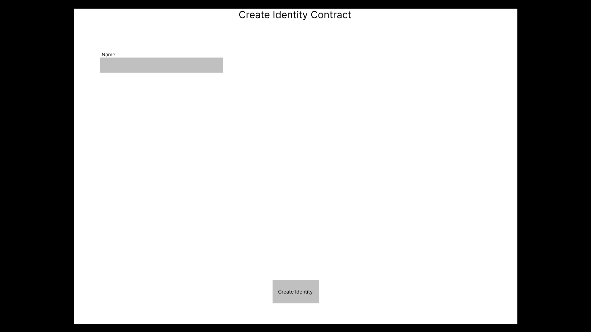
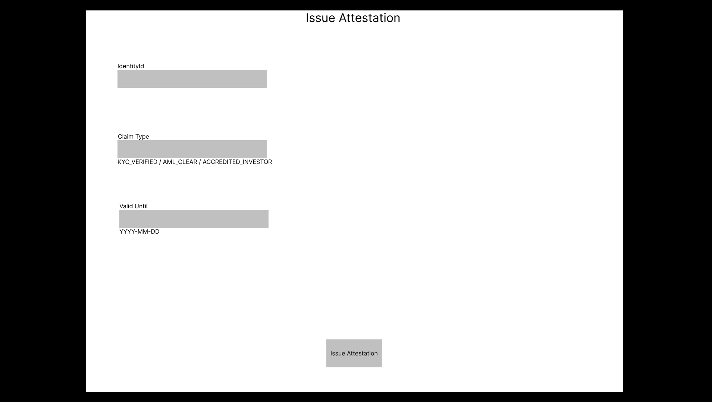
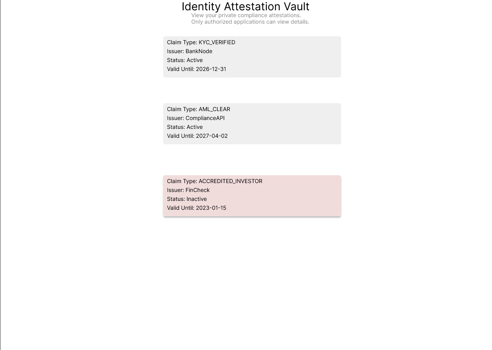

# **CantonID Vault — One KYC for the Entire Canton Ecosystem**

Users verify **once**. Every Canton-connected application consumes **private, reusable attestations**.  
No repeated KYC. No document uploads. Minimal cost. Full privacy.

---

# Tools and Technologies

- Canton ledger  
- Daml smart contracts (Identity, Attestation, AccessControl)  
- JSON API  
- Local Sandbox environment  
- Figma prototype  

---

# How It Works

1. User creates a private on-ledger identity.  
2. Regulated issuer performs KYC/AML and issues standardized attestations.  
3. Applications request access to a user's attestations.  
4. User grants access through an AccessControl contract.  
5. Apps see only the attestations they are authorized to view, never personal documents.

---

# Prototype Screens

Below are the key screens of the demo (images stored in `mockups/`):

### Create Identity

### Issue Attestation

### Identity Attestation Vault

---

# GitHub Repository Contents

- `daml/` — core smart contracts  
- `mockups/` — UI prototype screens  
- `README.md` — full project description  
- `TESTING.md` — instructions for running and testing the prototype  

---

# Why It Matters

Canton is onboarding banks, brokers, RWA platforms, custodians, and institutional venues.  
Major institutions such as Goldman Sachs, BNP Paribas, and Broadridge have already piloted Canton-based infrastructure,  
making them natural future issuers and operators in the ecosystem.  
Each of them must run KYC/AML - and today they all rebuild the flow independently.  
This is slow, expensive, and destroys conversion.

---

# Before → After

| Before                       | →   | After (Vault)                     |
|------------------------------|-----|-----------------------------------|
| 4 KYC processes per user     | →   | 1 verification for all apps       |
| $20–50 onboarding cost       | →   | ~$0 for verified users            |
| 25–40% drop-off per app      | →   | expected <5% drop-off             |
| Documents stored in 4 places | →   | stored once (issuer)              |
| 4 AML checks                 | →   | 0 downstream AML checks           |

Vault transforms fragmented onboarding into a shared, private compliance layer.

---

# Regulated Issuer Model

Reusable KYC only works if trust is anchored in regulated entities.  
Vault introduces a simple model:

- **Vault Issuers** — licensed KYC/AML providers  
- **Reliance framework** — apps rely on issuer verification instead of running their own  
- **Issuer responsibility** — issuer maintains compliance standards and monitoring  
- **Shared attestations** — apps reuse verified claims, never documents  

---

## Regulatory Alignment

### Trusted Issuer Model
- Attestations issued only by **regulated institutions**  
  (banks, VASPs, licensed KYC/AML providers)
- Issuers operate under existing compliance frameworks  
  (FATF, FinCEN, FCA, MAS)
- Each issuer registers an on-ledger identity with verifiable credentials
- Apps rely on these attestations similarly to established off-ledger KYC vendors

### Attestation Standards
- **Shared claim formats** across the ecosystem:
  - `KYC_VERIFIED`: ID verification + sanctions screening  
  - `ACCREDITED_INVESTOR`: Income/asset validation per jurisdiction  
  - `AML_CLEAR`: Ongoing monitoring + risk scoring
- Issuers implement standards according to local regulations
- Apps may require minimum issuer attributes (jurisdiction, license type)

### Liability & Assurance
- **Liability for KYC/AML accuracy remains with the issuer**  
  following standard delegation models
- Apps assume issuer-level risk similar to certificate trust chains
- Built-in safeguards:
  - Expiration-based revalidation  
  - Multi-issuer redundancy  
  - Immediate issuer-triggered revocation  
  - User migration to a new issuer without re-onboarding

### Cryptographic Integrity
- Attestations cryptographically signed with issuer keys registered on-ledger
- Canton consensus prevents forgery and ensures state integrity
- Apps maintain their own allow-lists of trusted issuers
- Full private audit trail stored on-ledger

### Jurisdictional Compliance
- Attestations include jurisdiction metadata (`EU`, `US`, `SG`, `UK`, etc.)
- Apps validate regulatory eligibility based on their own requirements
- Compliance preserved without exposing user documents thanks to Canton privacy

# What Vault Provides

- private, non-transferable on-ledger identity (`identityId`)  
- standardized attestations (`KYC_VERIFIED`, `AML_CLEAR`, `ACCREDITED_INVESTOR`)  
- validity windows + revocation  
- selective disclosure for relying applications  
- continuous AML monitoring reflected in attestations  

---

# Why This Works Only on Canton

Canton provides:

- contract-level privacy  
- selective disclosure  
- private cross-application interoperability  
- regulated trusted-issuer model  
- synchronized state for consistent issuance and revocation  

This enables a shared, reusable, private compliance layer not possible on public chains.

---

# User Flow

1. User creates an on-ledger identity  
2. Issuer verifies KYC/AML  
3. Issuer issues attestations  
4. Apps request access  
5. User approves  
6. App validates attestations privately  

**One verification → instant ecosystem access.**

---

# Why Builders Benefit

Teams no longer integrate KYC vendors or store documents.  
They simply check:

> “Does this user have the required valid attestations?”

This cuts onboarding work by ~80 percent and reduces compliance costs by 5–10x.

---

# Use Cases

- RWA onboarding (Black Manta, Zeconomy)  
- Institutional lending (Crypto Finance AG, Taurus)  
- Digital securities issuance (Texture Capital, D2X)  
- Custody and brokerage (Zodia Custody, BitGo)  
- Corporate onboarding (Republic, Meria)  
- Permissioned DEX / derivatives (Temple Digital Group, Hydra X)

---

# Prototype (Figma)

https://www.figma.com/proto/N2oaCqAgvBuXi0iknHOB5l/Untitled?node-id=1-2&p=f&t=WHMoLB9evIVxoQDK-1&scaling=min-zoom&content-scaling=fixed&page-id=0%3A1

---

**One KYC. One identity. Full ecosystem access.**
